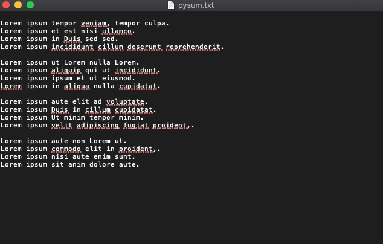

# Lorem Ipsum Generator
This python script allows you to generate lorem ipsum text.

## Demonstration


## Screenshot


## Features
- Generate lorem ipsum text
- Choose how many words you want.
- Choose how many paragraphs you want.
- Create .txt file with text ready to use.

## Languages/Tools used:
- Python
- Atom

## Installation
First download project from Github by going over to the green 'code' button and downloading the zip file. Once downloaded, extract the folder.

Then head over to the [python website](https://www.python.org/downloads/) to download the latest version of python.

Once that's done, you can check that it was successful by opening your terminal:

### Mac:
Keyboard shortcut is "command + spacebar" then search "terminal".
```
python3 --version
```

### Windows:
Keyboard shortcut is "ctrl + alt + w"
```
python --version
```

### Linux:
Keyboard shortcut is "ctrl + alt + t"
```
python --version
```

### Run application
```
python3 main.py
```

## Contributing
Pull requests are welcome. For major changes, please open an issue first to discuss what you would like to change.

## License
MIT
